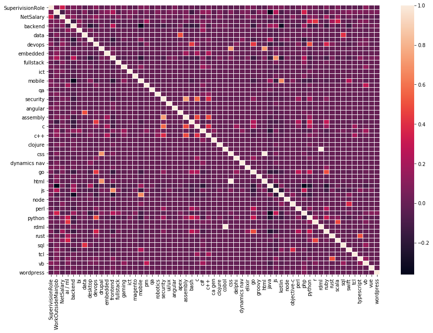
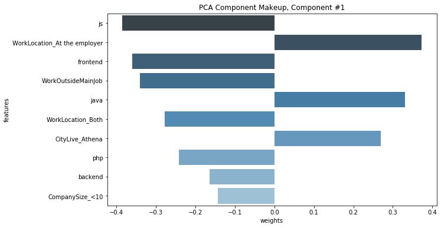

# Software Engineer Salary

## 1. Problem Definition

### 1.1 Project Overview

One of the most popular questions among graduate software engineers is the level of salary they should expect at their first job. The ecosystem of the software industry can be considered dynamic and very competitive. Therefore, the salary question persists and concerns even experienced professionals in the field. Due to the high demand for software solutions, new opportunities arise constantly and salary levels vary vastly [1].

On the other hand, companies try to compete for experienced personnel while also trying to stay completive from an employer standpoint. Having an overview of the software market salary levels is considered necessary for every human-resources department.

During September 2020, a YouTube channel named SocialNerds [2] released an anonymized dataset [3] of nearly 600 entries that describes salary levels of software engineers. The data was collected online during the summer of 2020 through a Google Forms questionnaire & commented upon on a video [4]. The participants are Greek software engineers working mostly for companies located in Greece or abroad.

### 1.2 Problem Statement

This project is an attempt to answer the following question:

> What should be the expected annual salary for a software technologist given specific criteria that describe both the employer and the employee?

The suggested solution includes the creation of a machine learning model based on current market data. The model should accept various information about a job candidate (software technologist) and a job description (company) while the output of the model should be an estimation about the expected salary level.

Starting with a defined problem and some data, this project is structured in a way that covers all the necessary steps needed in order to arrive to a working machine learning model. Moreover, the project structure adheres to the Amazon SageMaker workflow [5]. This section serves as an introduction to the project. The next sections and chapters focus on the analysis of the problem and the dataset, the implementation of a solution, the presentation of the results and finally a presentation of any concrete conclusions.

### 1.3 Metrics

The evaluation of the generated model will be conducted by withholding a part of the original dataset and use it for validation and testing purposes. Moreover, since the problem can be characterized as a quantitative analysis problem, the evaluation of the model should be done with corresponding metrics.

The following metrics were selected for the evaluation of the generated models t, as suggested in [6], [7] and [8]:

- Mean absolute error
- Median absolute error
- Root mean square error

More information about the metrics can be found in [8], however a short description of all three metrics is provided below for the reader.

- The mean absolute error is a risk metric corresponding to the expected value of the absolute error loss.
- The median absolute error is particularly interesting because it is robust to outliers. The loss is calculated by taking the median of all absolute differences between the target and the prediction.
- The root mean square error is a risk metric corresponding to the expected value of the root squared (quadratic) error or loss.

Moreover, according to [9] and [10], it is common practice to review the residuals for regression problems. A residual for an observation in the evaluation data is the difference between the true target and the predicted target. Residuals represent the portion of the target that the model is unable to predict.

The histogram of the residuals on the evaluation data when distributed in a bell shape and centered at zero indicates that the model makes mistakes in a random manner and does not systematically over or under predict any particular range of target values. If the residuals do not form a zero-centered bell shape, there is some structure in the model’s prediction error.

Therefore, apart from the metrics, a histogram plot will be generated that depicts the original values of the test data, the predicted values & their difference.

## 2. Problem Analysis

### 2.1 Exploratory Data Analysis

Since the dataset was retrieved through an online questionnaire, the users had to enter various information that can be described in the list below:

- Data & time when the form was submitted
- Years of past experience
- Type of software position/development
- Programming languages used in day to day development
- Company size
- Working remotely or on premises
- Having a managerial role
- Devoting time to personal projects
- Home location
- Work location
- Sex
- Annual net salary

A small sample of the data can be observed in figure 1.

For the needs of this project and as it was already discussed in chapter 1.2 the "Annual net salary" information should be treated as the target or dependent variable.

Furthermore, it is considered essential to check the dataset for any missing values. In table 1 a detailed count of missing values is provided for each column.

| Feature              | Missing values |
|----------------------|----------------|
| TimeStamp            | 0              |
| YearsExperience      | 0              |
| DevelopmentType      | 0              |
| ProgrammingLanguages | 0              |
| CompanySize          | 0              |
| WorkLocation         | 0              |
| SuperivisionRole     | 0              |
| WorkOutsideMainJob   | 7              |
| CityLive             | 0              |
| CityWork             | 297            |
| Sex                  | 10             |
| NetSalary            | 0              |

Table: Detailed count of missing values.

In the next pages, multiple figures and visualizations are provided in order to obtain a better overview regarding the inner characteristics of the data. For the dependent variable `NetSalary` multiple histograms (figures 8 and 10) were generated during the preprocessing steps in chapter 3.1.2. In figures 2 and 3 a set of pie and bar charts are provided for the most important features.

In figure 4 a heatmap was generated of new features created after the preprocessing of the original dataset. The heatmap depicts the correlation between some of the variables.

In table 2 a list of most correlated features to the dependent variable is presented.

| Feature          | Correlation |
|------------------|-------------|
| NetSalary        | 1.000000    |
| SuperivisionRole | 0.339406    |
| ruby             | 0.185516    |
| devops           | 0.134719    |
| scala            | 0.133792    |
| backend          | 0.107861    |
| objective-c      | 0.098164    |
| python           | 0.094827    |
| fullstack        | 0.082774    |
| r                | 0.079451    |
| ai / ml          | 0.078413    |
| go               | 0.070485    |
| clojure          | 0.064942    |
| ict              | 0.064942    |
| elixir           | 0.064942    |

Table: Most correlated features to the dependent variable `NetSalary`.

Finally, the following abnormalities were observed regarding the quality of the data:

- The original source of the data (online questionnaire form) was written in Greek. As a consequence, both header labels (form questions) and values (form answers) are in Greek.
- Many values are invalid or contain excess information. For example, in the salary input field many users entered text or other non-numerical values.
- The number of missing values is high for some features.
- Some features include text (list of tags) and have to be processed in a special manner. Most of the other features are categorical and will have to be converted to dummy variables.
- The dataset contains information mostly about men. The number of observations related to women is very low. This might introduce bias to the generated model.
- The number of observations is low. The original dataset includes 586 entries. However, even under those circumstances, the dataset is evaluated as worthwhile for further analysis and even model creation since it contains real, recent data.

### 2.2 Algorithms and Techniques

In chapter 1.3 it was mentioned that the problem can be characterized as a quantitative analysis problem. This can be also confirmed by:

1. The problem and question statement described in chapter 1.2.
2. The nature of the dataset described in chapter 2.1. It is reminded that the most important variable is the one describing the net salary levels of our cases.

As of the time of writing, Amazon SageMaker provides two built-in machine learning algorithms for quantitative analysis problems [11]:

- Linear learner algorithm [7]
- XGBoost algorithm [12]

It should be mentioned that Amazon SageMaker also offers the alternative option to use popular machine learning and deep learning framework algorithms like PyTorch and Scikit-learn [13]. However, the usage of extra algorithms was deemed as unnecessary for the scope of this project.

Last but not least, an unsupervised machine learning algorithm was used in order to perform a dimensionality reduction on the original dataset. Amazon SageMaker offers the Principal Component Analysis (PCA) algorithm that attempts to reduce the number of features within a dataset while still retaining as much information as possible [14].

### 2.3 Benchmark

The solutions that were created and are described in the next steps have to be evaluated and compared against a baseline performance. Therefore, a simple benchmark model was created that serves as a reference point for the final results.

A common reference point when discussing salary levels is to refer to the mean or median of the software salary distribution. People frequently refer to the "average salary" for a software developer. Based on that assumption, the benchmark model used in this project is a simple, hypothetical model that always predicts the expected salary as the median of salaries that are available in the training dataset. The median was prefered instead of the mean because it is not affected by outlier values.

This way, it can be easily determined through the analysis of the evaluation metrics if the generated models are performing better than the simplistic, "median salary", benchmark model.

## 3. Solution Implementation

### 3.1 Data Preprocessing

A list of abnormalities was documented in chapter 2.1 after exploring the original dataset. To alleviate those problems, the following preprocessing steps were applied.

### 3.1.1 Semi-automated translation of the original dataset.

The dataset is loaded and translated in an automated way using the googletrans Python library [15]. The header (see figures 5 and 6) labels are translated first and then converted to shorter camel cased descriptions. Next, the dataset values are checked for Greek characters and also translated in the same manner. The translations are checked manually and any necessary corrections are made.

### 3.1.2 Data curation due to mistakes during user input.

Since the original values were retrieved through an online survey, many answers contain mistakes and were not entered in a proper state or type. The goal of this step is to curate any received data without major modifications or deletions.

### NetSalary column

The NetSalary column had to be curated as it contains non numeric values (see figure 7). The Greek decimal separator (comma) is replaced with the US separator (period). Non numeric values had to be investigated and curated manually. Any comments or textual hints added by the user into the input field are taken into acount. In some cases, observations were removed because the NetSalary value could not be explained.

The NetSalary column values were plotted into a histogram so we can check the distribution and any outliers (see figure 8). Some of the outlier values are adjusted or removed.

In figure 9 the histogram includes only NetSalary values less than 10000.

The final change performed on the NetSalary column is to curate the low values. It is assumed that any values equal or lower than 104 represent thousands of EUR currency. Any values from 105 up until 4000 refer to monthly net salaries. Therefore, the NetSalary values were curated accordingly (either multiplied by 1000 or by 14 - in Greece employees are paid 14 salaries per year). Finally, any cases including zero values are removed from the dataset. Figure 10 contains the final histogram of the NetSalary column values.

### DevelopmentType & ProgrammingLanguages columns

The `DevelopmentType` and `ProgrammingLanguages` columns include strings of comma-separated values relevant to various software topics and programming languages. Those comma-separated values were extracted and converted to tags after careful manual curation. The result was the creation of dummy variables, one for each tag. The value of that variable is either 1 or 0, denoting the existence or absense of that tag.

### CityLive & CityWork columns

The values of the `CityLive` and `CityWork` are checked and curated manually. Spelling mistakes are corrected and missing values are assigned when the submitted texts refer to invalid values.

### SuperivisionRole & WorkOutsideMainJob columns

The values of the `SuperivisionRole` and `WorkOutsideMainJob` columns are converted from the Yes/No textual values to 1/0 numeric values.

### 3.1.3 Fill missing values

We see that the `WorkOutsideMainJob` column has 6 missing values. We replace the missing values by assigning a negative semantic value (zero). We interpret the absense of an answer as negation. The `CityLive` column contains only 1 missing value. The case can be considered as an outlier & since it does not contain a lot of information it is dropped.

### 3.1.4 Create dummy variables

Since the columns YearsExperience, CompanySize, WorkLocation amd CityLive can be considered as categorical variables, they should be converted to dummy variables.

### 3.1.5 Feature selection

In the last step, it is decided that the following columns should be dropped. `TimeStamp` does not offer any useful information. The `DevelopmentType` and `ProgrammingLanguages` columns were converted into dummy variables in a previous step. `CityWork` contains too many missing values. Finally, `Sex` is dropped due to its uneven distribution. This might introduce bias against women/females.

### 3.1.6 Preprocessed dataset

Once all the preprocessing steps are performed, the dataset now includes 579 entries and 112 features. All features except the `NetSalary` can be considered as categorical features converted to dummy variables. As a result, all independent variables are binary.

### 3.2 Implementation

As mentioned in chapter 2.2, two Amazon SageMaker built-in machine learning algorithms were used:

- Linear learner algorithm [7]
- XGBoost algorithm [12]

Since both algorithms can be used also for classifications problems, necessary settings have to be applied through the hyperparameters in order to configure the algorithms for linear regression.

Furthermore, for both algorithms, the number of epochs or rounds was configured to a higher value than the default one. According to [16], data sets with only a few observations typically require more passes over the data to obtain higher model quality. For Linear learner, `epochs` was configured to 80 and for XGBoost `num_round` was configured to 50.

Due to the low amount of data it was decided to keep only 10% of the data for validation or test purposes.

Both algorithms use a similar procedure in order to generate predictions. First an estimator is fitted (trained) with the training data. Then the trained model is deployed through an endpoint and predictions are generated on the test data. Once done, the endpoints are deleted to avoid extra billing.

Finally, it should be mentioned that the following Python libraries were used for various tasks, like data splitting or metrics calculation: pandas, 
NumPy, scikit-learn and Amazon SageMaker Python SDK. Parts of the implementation were also based on the following resources [17], [18].

### 3.3 Refinement

As it is stated in chapter 3.1.6, the preprocessed dataset consists of 112 columns (excluding the `NetSalary` column). The only major refinement step apart from any bug fixing was the application of principal component analysis (PCA) in order to reduce the dimensionality of the preprocessed dataset [14]. PCA attempts to reduce the number of features within a dataset while retaining the "principal components", which are defined as weighted, linear combinations of existing features that are designed to be linearly independent and account for the largest possible variability in the data.

The principal component analysis model is created and initially consists of 111 components. However, when creating new dimensionality-reduced data, only a few top n components should be selected. To decide how many top components to include, it's helpful to look at how much data variance the components capture.

For the original, high-dimensional data, 112 features captured 100% of our data variance. The goal is to reduce the dimensions in order to capture 80%-90% of the data variance. It was decided to keep the top 18 components which resulted in an explained variance of 80.89%.

For demonstation purposes we analyze the feature-level makeup of the two major components (see figures 11 and 12).

It is observed that the first major component represents software developers that focus heavily on Java development, are working in Athens and at the premises of the employer. Front-end development (JavaScript) is not their primary activity and they are not employed by small companies.

The second major component represents experienced software developers that focus on devops and Python. They have a supervision role. Some of them develop in Ruby or Go. They don't focus on Java or JavaScript.

The generated PCA dataset is used in the next steps and compared to the original dataset when the performance of algorithms is evaluated.

## 4. Results

This section describes the results obtained after the creation of the aforementioned models and the generation of predictions for the test dataset. Figures 13 to 17 depict the histograms of the original, predicted & residual values for the test dataset.

For all the models, the residual distribution (in green color) seems to be distributed in a bell shape and centered at zero. This fact indicates that our models are not underfitted nor overfitted. The predictions distribution (orange color) overlaps the original distribution (blue color) in most cases.

Furthermore, the result metrics are recorded in table 3. It is obvious that the best performance is credited to the XGBoost algorithm trained on the full curated dataset. Both algorithms had better or equal performance when trained on the full dataset. In all cases, both algorithms perform better than the benchmark model.

## 5. Conclusions

In this section the reader can find a list of any important conclusions or findings.

- All generated models outperformed the benchmark model proving that even with a small dataset a machine learning model can provide adequate predictions.
- For the current dataset the best performance was achieved by using the XGBoost algorithm.
- The dimensionality reduction on the curated dataset did not enhance the performance of the generated models but reduced the dataset size by at least 80%.
- The components generated by the principal component analysis can describe the major software developer profiles of the dataset. In chapter 3.3 it was observed that the two major profiles consist of developers focused on 1) Java developers and 2) developers that focus on devops & Python.
- According to table 2, the salary level is highly correlated to supervision roles, devops, backend development activies and the following programming languages: ruby, scala.
- According to the figure 10, the software developer salary distribution is centered around 16.000 and 17.000 EUR per year.

| Model - Error        | Mean absolute | Median absolute | Root mean square |
|----------------------|---------------|-----------------|------------------|
| XGBoost              | 3629.94       | 1509.66         | 7509.41          |
| Linear Learner       | 4919.77       | 3445.23         | 8751.81          |
| XGBoost (PCA)        | 5152.74       | 2255.69         | 8864.64          |
| Linear Learner (PCA) | 5196.77       | 3192.44         | 8456.20          |
| Benchmark            | 7054.61       | 4700.0          | 10289.06         |

Table: Performance metrics for all generated models.